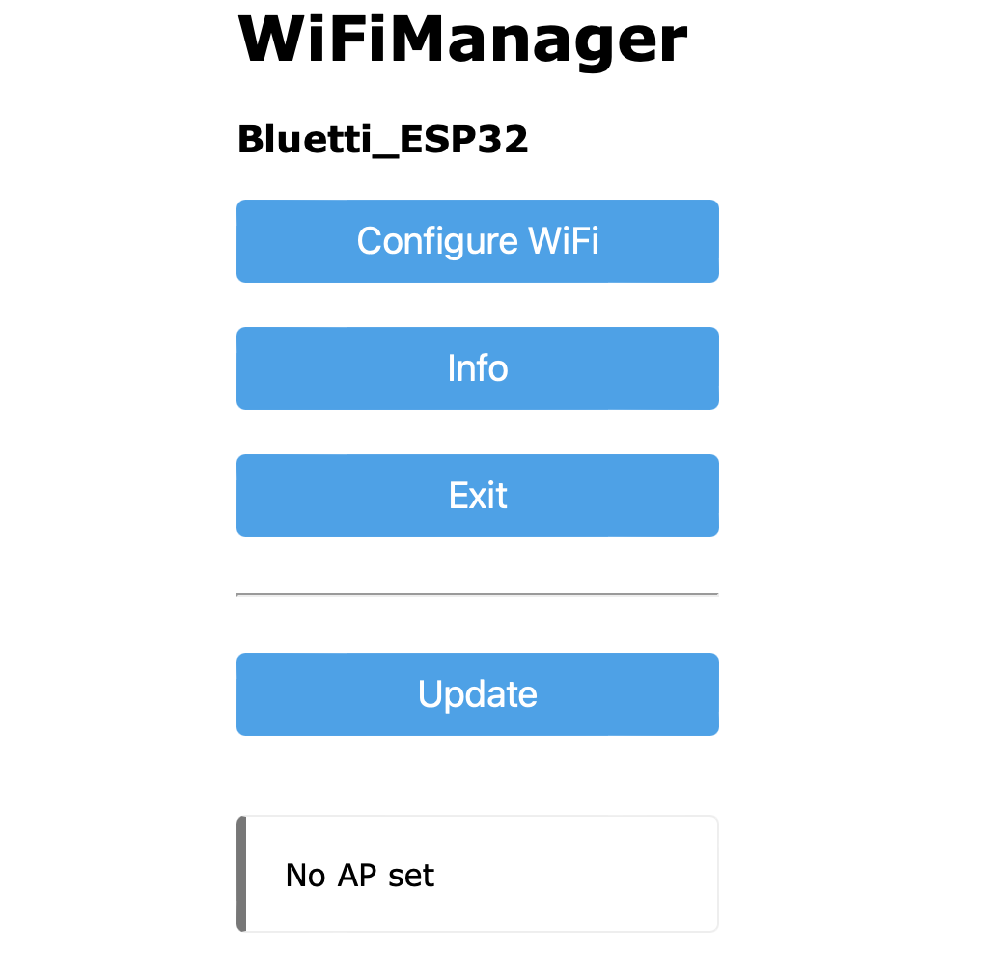

17.07.2024, I have no longer a Bluetti EB3A, so will no longer support this repo/project 

-------

# EB3A_Bluetti_ESP32_HA
Interface between Bluetti-EB3A and HA by using a ESP32 with Bluetooth and MQTT (see below original)

Extended with focus to EB3A
- Servo attached to ESP32 for switching on the EB3A if BLE is powered down by the EB3A (called by MQTT or fallback HTTP (see: https://github.com/mariolukas/Bluetti_ESP32_Bridge/issues/30)
- HA Discovery config is send to MQTT by external python script and config in file (modifications possible without recompile/reflash)
- Send Connected Status BT&MQTT via MQTT for using in HA (but only BT useful because if MQTT isn't connected the info is not up to date, additional ping ESP32 from HA to check if ESP is still alive)
- More functions for EB3A possible (LED, ECO_MODE, ...) !But lot's "Quick&Dirty"!
- No auto Reboot ESP32 if Bluetooth is not connected, because EB3A switch Bluetooth off after ~1h (when nothing is active)
  Therefore is the Servo to switch on again and also power consumption can be optimized when Bluetooth is not all the time on on EB3A.
  So the EB3A can be switched on/off on request and minimize power consumption of the little Bluetti ;-)
- ...

(- controlling will be done in HA by Automations, ...)

<b>!!! Lot's is Quick&Dirty because needed the EB3A running for Solar over-production redirection ;-) !!!</b>
<p align="center">
   
   
  
<br>
<ins><b><i> Example: HA and MQTT</i></b></ins>
</p>
<p align="center">
   
<br>
<ins><b><i> Example: Servo</i></b></ins>
</p>

Todo:
- Remove Quick&Dirty ;-)
- for state-topic for some entities (e.g. LED_MODE, CHARGING_MODE, ...) currently the command-topic is used until state can be read from the EB3A
- implement ha discovery config in ESP instead of external 
- ESP sometimes stuck right after "publish topic for field: internal_dc_input_voltage" but is reachable by http (e.g. for request reboot to work again)
- ...

(Have put everything in new repository because too much implemented Quick & Dirty for EB3A)

--------------------

Initial ideas by and thanks to:
- https://github.com/mariolukas/Bluetti_ESP32_Bridge
- https://github.com/warhammerkid/bluetti_mqtt


Original from above:

--------------------

## About
This is an ESP32 based Bluetooth to MQTT Bride for BLUETTI power stations. The project is based on https://github.com/warhammerkid/bluetti_mqtt
The code is tested on a AC300. Other Powerstations should also work but are untested yet. The discussion on https://diysolarforum.com/threads/monitoring-bluetti-systems.37870/ was a great help for understanding the protocol. 

## Community
Join the Discord Server https://discord.gg/6ukb8rnk

## Features

* easy configuration with WiFi manager
* mqtt support
* support for BLUETTI power stations
  * AC300 (tested)
  * AC200 (untested)
  * EB3A (tested)
  * EP500 (untested)
  * EP500P (tested)
* supported BLUETTI functions
  * commands
    * ac output on/off
    * dc output on/off
  * states
    * ac input power
    * dc input power
    * ac output power
    * dc output power
    * dsp firmware version
    * arm firmware version
    * serial number
    * device type
    * power generation
    * total battery percent

## Getting Started

### Compiling and Flashing to ESP32

#### Arduino IDE

You will need to install a board support package for your ESP32. Additionally the following libraries are needed: 

* https://github.com/tzapu/WiFiManager
* https://github.com/knolleary/pubsubclient
* https://github.com/ayushsharma82/AsyncElegantOTA
* https://github.com/me-no-dev/ESPAsyncWebServer
* https://github.com/me-no-dev/AsyncTCP/archive

Change the partition scheme with Tools -> Partition Scheme to

* Minimal SPIFFS (1.9 MB App with OTA/ 190KB SPIFFS)


This setting is required because the Bluetooth stack already uses a lot of the ESP32 memory.

Optional: Do changes in config.h file. The device can be set by changing 'BLUETTI_TYPE'.

Finally upload the Sketch to your ESP32.

*INFO*: Until now only BLUETTI_AC300, BLUETTI_EP500P was tested. If you own one of the supported devices please let me know if it works.

#### PlatformIO

Compiling
```
$ pio run
```

Flashing Factory Image
```
$ esptool.py write_flash 0x0 build/Bluetti_ESP32_Bridge.factory.bin
```

Updating only App (don't delete settings)
```
# Write Partition A
$ esptool.py write_flash 0x10000 build/Bluetti_ESP32_Bridge.ota.bin
...
# Write Partition B
$ esptool.py write_flash 0x1F0000 build/Bluetti_ESP32_Bridge.ota.bin
```

The configuration interface also offers OTA updates. You can flash also `build/Bluetti_ESP32_Bridge.ota.bin` there. If you already configured your device you can use `http://<ip_address/update` to update your firmware (no-reconfiguration needed)

### Usage

Just connect the ESP32 to a power supply or the power station itself. Connect your mobile phone or computer
to the Wifi mangaer of the ESP32 firmware, it should show up as "ESP32_Bluetti".

After the connection to the hotspot is established a wifi manager popup will appear. Otherwise
open 192.168.4.1 in your local webbrowser.

Select "Configure WiFi"



Configure your WiFi and set the address of your MQTT server and enter the Bluetooth ID of your
Bluetti Device. Optionally you can specify username and password to protect the web OTA interface.
You can use a mobile phone and/or the Bluetti APP for finding the correct Bluetooth ID of your device.


Save the settings. The ESP32 starts sending messages to your MQTT server.

Example ( ioBroker ):


### MQTT Topics

#### Commands
Commands are subscribed from

* /bluetti/<your_device_id>/command
  * ac_output_on
  * dc_output_on

#### State
States are published to
* /bluetti/<your_device_id>/state
  * ac_output_on
  * dc_output_on
  * dc_input_power
  * ac_input_power
  * ac_output_power
  * dc_output_power
  * serial
  * dsp_version
  * arm_version
  * power_generation
  * total_battery_percent


## TODO

* add full feature set to device files
* adding support for OLED display
* adding support for SD-Card reader, for writing csv data to an sd-card
* adding logging poll commands

## Disclaimer

The code within this repository comes with no guarantee, use it on your own risk.

Don't touch these firmwares if you don't know how to put the device in the programming mode if something goes wrong.
As per the GPL v3 license, I assume no liability for any damage to you or any other person or equipment.
